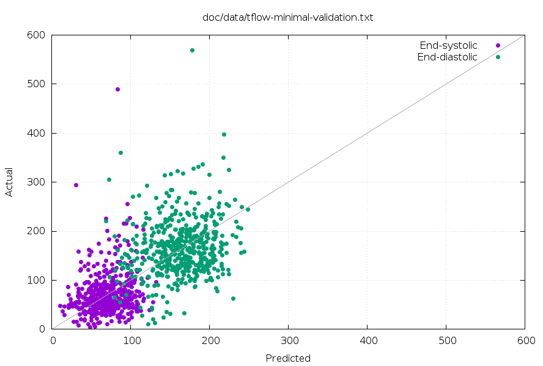

Model Performance Report
========================

This file is intended to document the performance of the various models.
Typically, models are measured using 10-fold cross validation, and storing the
predictions made in each fold.

To regenerate the images in this report, run:

    make
    make -f Makefile.model clean
    make -j1 -f Makefile.model

# tflow-minimal.py

This is a single-layer network using only the first frame of each 2 chamber or
4 chamber view.  This is equivalent to linear regression using the scaled pixel
data as explanatory variables.

## 2 Chamber View Model

## 4 Chamber View Model

# tflow-4ch-stack

This model is trained on all 30 frames of each 4 chamber view.

